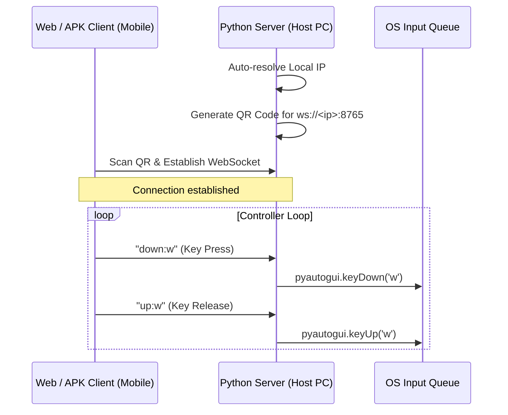

# ROV: Mobile-to-PC Input Streaming Controller
<br><br>
<p align="center">
  <strong>A high-performance Remote Controller that streams keyboard inputs from a mobile device or web browser directly to your PC.</strong>
</p>

<p align="center">
  <a href="LICENSE"></a>
  
  
  
</p>

---

##  Elevator Pitch

Ever wanted to play keyboard-heavy games like *Hollow Knight* or navigate your media player from your couch without wearing out your laptop keyboard or buying an expensive gamepad? **ROV** turns your mobile phone (via a dedicated Android app or any web browser) into an ultra-low latency virtual controller. It pairs instantly via a QR code and simulates native hardware key inputs on your host machine.

---

##  Key Features

*   **Zero Configuration Pairing**: Start the server and scan the generated QR code to connect instantly.
*   **Dual Client Support**: Use the native Android APK client or access the web-based controller page via any browser.
*   **Minimal Latency**: Driven by low-overhead WebSockets for real-time responsiveness.
*   **Glassmorphic Design**: A gorgeous, touch-optimized visual keyboard using modern glassmorphism aesthetics.
*   **Auto-reconnect & Latency Testing**: Automatically measures latency in real-time and handles network dropouts gracefully.
*   **Native OS Simulation**: Simulates keypresses at the OS level, working seamlessly with games and system shortcuts.

---

##  Tech Stack

*   **Backend Server**: Python 3, `asyncio`, `websockets`, `pyautogui`, `qrcode`, `pillow`
*   **Web Client**: Vanilla HTML5, modern CSS3 (Glassmorphism design, Inter/Outfit typography), native ES6 WebSockets
*   **Mobile Client**: Flutter / Dart (APKs pre-compiled)

---

##  System Architecture



---

##  Quick Start

### Prerequisites
*   Python 3.8 or higher.
*   Make sure both your PC and mobile device are connected to the **same local Wi-Fi network**.
*   Ensure that any VPN client is turned off on both devices.

### 1. Installation
Clone the repository and install the dependencies:
```bash
git clone https://github.com/aryan/Controller.git
cd Controller
pip install -r requirements.txt
```

### 2. Start the Server
Run the python server from the root directory:
```bash
python src/server.py
```
This will:
1. Detect your local IP address.
2. Launch a window displaying a QR code.
3. Start the combined Web (HTTP) and WebSocket (WS) server on port `8765`.

### 3. Connect the Client

#### Option A: Web-based Controller (Recommended)
Open your phone's browser and navigate to:
```text
http://<YOUR_PC_IP>:8765
```
*(The exact URL will be printed in the server log on startup. You can also scan the QR code to open it directly if your QR reader supports web URLs).*
The web client will load a premium controller UI and automatically connect!

#### Option B: Android Native Client
1. Find the pre-compiled APK in the `/releases` folder (`ROV_V_2.4.5.zip` contains `rov_1.3.apk`).
2. Sideload the APK onto your Android device.
3. Open the app, tap **Scan**, and scan the QR code displayed on your PC screen.

---

##  Project Structure

```text
Controller/
│
├── .github/                 # GitHub workflows & issue/PR templates
│   └── workflows/
│       └── lint.yml         # CI Linting check
│
├── assets/                  # High-quality banners and logos
│   ├── banner/
│   └── logo/
│
├── docs/                    # Detailed project documentation
│   ├── ARCHITECTURE.md      # In-depth system design & data flow
│   ├── CONFIGURATION.md     # Ports, arguments, and network settings
│   ├── CONTRIBUTING.md      # Setup environment & coding standard
│   ├── FAQ.md               # Latency, firewall, and connection troubleshooting
│   └── INSTALLATION.md      # Setup, executable packaging, and sideloading
│
├── releases/                # Bundled pre-built binaries (EXE & APK)
│   ├── ROV_V_1.8.2.zip
│   └── ROV_V_2.4.5.zip
│
├── src/                     # Core source code
│   ├── client/
│   │   └── index.html       # Modern Glassmorphic Web Client
│   └── server.py            # Combined WebSocket and HTTP host server
│
├── CODE_OF_CONDUCT.md       # Open-source community guidelines
├── SECURITY.md              # Vulnerability disclosure policy
├── CHANGELOG.md             # Version history
├── LICENSE                  # MIT License
├── requirements.txt         # Pip dependency list
└── pyproject.toml           # PEP 518 project config metadata
```

---

##  Detailed Documentation

For advanced setup and development guides, refer to:
*   [Architecture Details](docs/ARCHITECTURE.md) — How the protocol and simulated input loop works.
*   [Installation Manual](docs/INSTALLATION.md) — Detailed setup, PyInstaller bundling, and Android APK deployment.
*   [Configuration Guide](docs/CONFIGURATION.md) — Port customisation, CLI args, and key bindings.
*   [FAQ & Troubleshooting](docs/FAQ.md) — Solving latency, firewall, and Wi-Fi pairing issues.
*   [Contributing Guide](docs/CONTRIBUTING.md) — How to submit pull requests and set up local development.

---

##  Security

This project communicates unencrypted over your local network. It is intended strictly for private home Wi-Fi networks. Do not share your server's QR code or run the server on public, untrusted networks, as anyone on the network could simulate keystrokes on your system. See [SECURITY.md](SECURITY.md) for more details.

---

##  License

Distributed under the MIT License. See [LICENSE](LICENSE) for more details.

---

##  Acknowledgements

*   Developed out of passion to play *Hollow Knight* without wearing out physical keyboards.
*   Special thanks to the open-source python `pyautogui` and `websockets` library maintainers.
