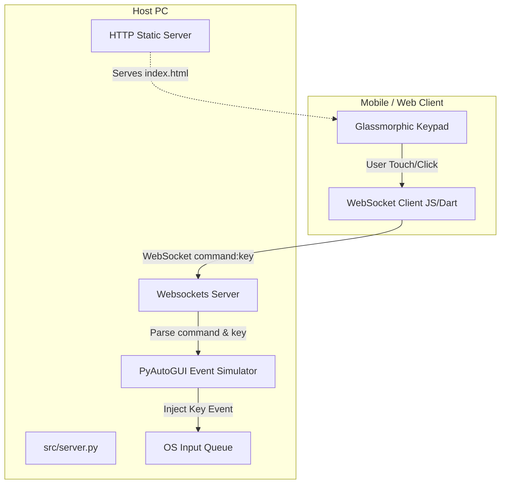

# System Architecture

This document describes the architectural layout, communication protocols, and design decisions behind the **ROV Remote Controller**.

---

## 1. High-Level Component Design

The system follows a lightweight Client-Server pattern optimized for low-latency message passing.



The system comprises two major components:
1.  **Host Server (Python)**:
    *   Runs on the host machine where inputs should be simulated.
    *   Binds a socket listener that acts as both an HTTP static fileserver (to serve the Web Client) and a WebSocket server.
    *   Interacts with PyAutoGUI to feed simulated keystrokes into the operating system's global input queue.
2.  **Controller Clients**:
    *   **Android App**: A compiled Flutter application that provides gamepad UI controls and scans QR codes to connect.
    *   **Web Client**: A browser-rendered touch layout optimized for mobile screens. Serves as a zero-installation alternative to the APK.

---

## 2. Combined Port Server Design

The Python backend achieves extreme ease-of-use by running both the HTTP server and the WebSocket server on the **same TCP port** (default: `8765`).

When a client initiates a TCP connection:
1.  The `websockets.serve` hook intercepts the initial HTTP request via `process_request`.
2.  **WebSocket Handshake**: If the request contains the HTTP headers `Upgrade: websocket`, the handler returns `None`. This lets the websockets framework execute the standard RFC 6455 handshake, upgrading the connection.
3.  **HTTP Request**: If the `Upgrade` header is missing, the request is handled as a standard HTTP GET. If the path matches `/` or `/index.html`, the server reads `src/client/index.html` from the disk and responds with status `200 OK` and a `text/html` body. Otherwise, it returns `404 Not Found`.

---

## 3. Communication Protocol

All runtime control data is transmitted over WebSocket frame packets to minimize overhead.

### Connection Handshake
On startup, the server resolves the local IP address (typically `192.168.x.x` or `10.x.x.x`) and generates a WebSocket URI:
```text
ws://<LOCAL_IP>:<PORT>
```

### Event Messaging Schema
All events sent from the client to the server are formatted as UTF-8 text strings:

#### 1. Keystroke Messages
Format:
```text
<action>:<key_identifier>
```
*   `action`: Can be `down` (representing key down/press) or `up` (representing key up/release).
*   `key_identifier`: A string mapped to a physical key. This identifier must be a valid key name supported by PyAutoGUI (e.g. `w`, `a`, `space`, `enter`, `shift`, `left`, `right`).

*Example Payload*:
```text
down:space     # User presses the space bar
up:space       # User releases the space bar
```

#### 2. Keep-Alive / Latency Pings
To measure network latency and prevent routers from reaping idle connections, the client sends a heartbeat message:
*   **Request**: Client sends the text frame `"ping"`.
*   **Response**: Upon receiving `"ping"`, the server immediately echoes back `"pong"`. The client calculates the round-trip time (RTT) as:
    $$\Delta t = t_{\text{receive}} - t_{\text{send}}$$

---

## 4. Input Simulation Mechanics

On the host machine, simulated key events are injected using **PyAutoGUI**. 

*   **Failsafe**: By default, PyAutoGUI halts script execution if the mouse cursor is moved to a corner of the screen. Because this is a utility designed to run continuously in the background, we explicitly disable this failsafe:
    ```python
    pyautogui.FAILSAFE = False
    ```
*   **Minimum Latency**: We reduce artificial pauses between inputs to zero to achieve near-instant gameplay reaction times:
    ```python
    pyautogui.PAUSE = 0
    ```
*   **Stateful Injection**: The keyboard buttons send separate `down` and `up` events. The server calls `pyautogui.keyDown(key)` and `pyautogui.keyUp(key)` in response. This allows the host OS to recognize held-down keys (e.g., holding arrow keys to run or jump in games).
